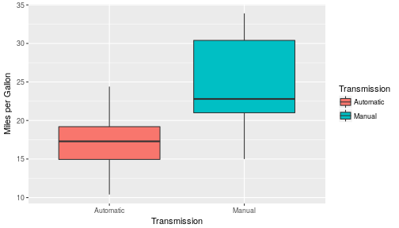
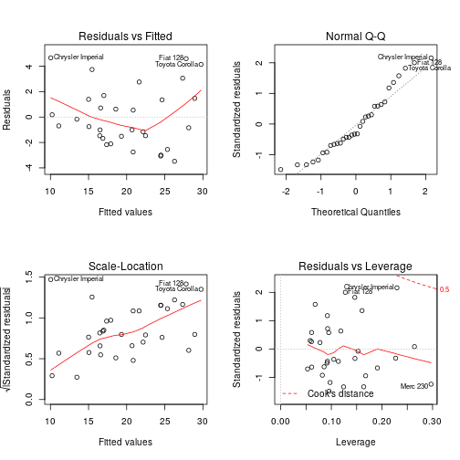

## Executive Summary

This project uses the "mtcars" dataset in order to answer the following question:

* Is an automatic or manual transmission better for fuel consumption?

To answer this question we will first compare the mean of the "mpg" variable  (miles per gallon) for automatic and manual transmissions. We'll perform a T-test to check if the difference in mean is statistically significant. After we check that, we'll fit different linear models with the aim of finding the model that best accounts for the variability in fuel consumption. Finally, once we find such model, we will check the model assumptios: normality of the residuals and homoscedasticity.


## Process the Data

From the documentation of the "mtcars" dataset we get a succint description of the data:
"the data was extracted from the 1974 Motor Trend US magazine, and comprises fuel consumption and 10 aspects of automobile design and performance for 32 automobiles (1973–74 models)".

In order to perform the relevant analysis we first change the variable "am" to a factor with two levels: "Automatic" and "Manual"


```r
library(datasets)
library(ggplot2)
```

```
## Need help getting started? Try the cookbook for R:
## http://www.cookbook-r.com/Graphs/
```

```r
data(mtcars)
#change am variable to factor
mtcars$am <- as.factor(mtcars$am)
levels(mtcars$am) <-c("Automatic", "Manual")
```

## Exploratory Data Analysis

We start the analysis by computing the mean of "mpg" for each transmission type:


```r
mean(mtcars[mtcars$am=="Automatic","mpg"])
```

```
## [1] 17.14737
```

```r
mean(mtcars[mtcars$am=="Manual","mpg"])
```

```
## [1] 24.39231
```

The cars with manual transmission have a higher mean of miles per gallon. We check that this difference seems to be significant with the following boxplot:



### Difference in means

The Boxplot indeed points to a difference in means of "mpg". We proceed to test the hypothesis that the means are equal with a T-test:


```r
t.test(mtcars$mpg~mtcars$am,conf.level=0.95)
```

```
##
## 	Welch Two Sample t-test
##
## data:  mtcars$mpg by mtcars$am
## t = -3.7671, df = 18.332, p-value = 0.001374
## alternative hypothesis: true difference in means is not equal to 0
## 95 percent confidence interval:
##  -11.280194  -3.209684
## sample estimates:
## mean in group Automatic    mean in group Manual
##                17.14737                24.39231
```

The p-value is 0.001374 so we reject the null hypothesis. There seems to be a true difference in mpg mean between cars with automatic transmission and cars with manual transmission. However this conclussion is based on the assumption that all other characteristics of the cars are equal (# of cylinders, weight etc) and certainly this is not the case. Thus we need to perform further analysis by fitting a few linear models.

### Regression Models

We start by fitting the simplest possible model: Miles per Gallon (mpg) explained by Transmission Type (am):


```r
fit1 <- lm(mpg ~ am, data = mtcars)
coef(fit1)
```

```
## (Intercept)    amManual
##   17.147368    7.244939
```

```r
summary(fit1)$r.squared
```

```
## [1] 0.3597989
```

Both coefficients of the model are statistically significant (small p-values). The intercept of the model is just the mean miles per gallon for cars with automatic transmission. The slope of the regression line indicates an average increase of 7.245  miles per gallon for cars with manual transmission. The R-squared, however, indicates that roughly just 36% of the variation is explained by this model. This seems natural since some other variables such as weight, number of cylinders, number of carburators etc could also influence the fuel consumption. Having that in mind we now fit a model mpg vs all the other variables in the data set:


```r
fit2 <- lm(mpg ~ ., data = mtcars)
summary(fit2)
```

```
##
## Call:
## lm(formula = mpg ~ ., data = mtcars)
##
## Residuals:
##     Min      1Q  Median      3Q     Max
## -3.4506 -1.6044 -0.1196  1.2193  4.6271
##
## Coefficients:
##             Estimate Std. Error t value Pr(>|t|)
## (Intercept) 12.30337   18.71788   0.657   0.5181
## cyl         -0.11144    1.04502  -0.107   0.9161
## disp         0.01334    0.01786   0.747   0.4635
## hp          -0.02148    0.02177  -0.987   0.3350
## drat         0.78711    1.63537   0.481   0.6353
## wt          -3.71530    1.89441  -1.961   0.0633 .
## qsec         0.82104    0.73084   1.123   0.2739
## vs           0.31776    2.10451   0.151   0.8814
## amManual     2.52023    2.05665   1.225   0.2340
## gear         0.65541    1.49326   0.439   0.6652
## carb        -0.19942    0.82875  -0.241   0.8122
## ---
## Signif. codes:  0 '***' 0.001 '**' 0.01 '*' 0.05 '.' 0.1 ' ' 1
##
## Residual standard error: 2.65 on 21 degrees of freedom
## Multiple R-squared:  0.869,	Adjusted R-squared:  0.8066
## F-statistic: 13.93 on 10 and 21 DF,  p-value: 3.793e-07
```
This model increases the R-squared but this could be due to the mere adding of variables, and also none of the variables are significant enough. We now perform a stepwise regression to find a better model with the help of the stepAIC function which selects a best model by using Akaike Information Criterion:


```r
# Stepwise Regression
library(MASS)
fit3 <- lm(mpg~.,data=mtcars)
step <- stepAIC(fit3, direction="both")
```


```r
summary(step)
```

```
##
## Call:
## lm(formula = mpg ~ wt + qsec + am, data = mtcars)
##
## Residuals:
##     Min      1Q  Median      3Q     Max
## -3.4811 -1.5555 -0.7257  1.4110  4.6610
##
## Coefficients:
##             Estimate Std. Error t value Pr(>|t|)
## (Intercept)   9.6178     6.9596   1.382 0.177915
## wt           -3.9165     0.7112  -5.507 6.95e-06 ***
## qsec          1.2259     0.2887   4.247 0.000216 ***
## amManual      2.9358     1.4109   2.081 0.046716 *
## ---
## Signif. codes:  0 '***' 0.001 '**' 0.01 '*' 0.05 '.' 0.1 ' ' 1
##
## Residual standard error: 2.459 on 28 degrees of freedom
## Multiple R-squared:  0.8497,	Adjusted R-squared:  0.8336
## F-statistic: 52.75 on 3 and 28 DF,  p-value: 1.21e-11
```

```r
confint(step)
```

```
##                   2.5 %    97.5 %
## (Intercept) -4.63829946 23.873860
## wt          -5.37333423 -2.459673
## qsec         0.63457320  1.817199
## amManual     0.04573031  5.825944
```

This model explains roughly 85% of the variation in mpg. It includes weight (wt) 1/4 mile time (qsec) and Transmission (am). The coefficient of amManual is 2.9358 which means that with equal weight (wt) and equal 1/4 mile time (qsec), cars with manual transmission have an increase of 2.9358 miles per gallon.

## Conclusions

 *  Cars with a manual transmission are better for fuel consumption measured by miles per galon than cars with an automatic transmission.
 *  The best model we found indicates that 85% of the variation in mpg is explained by type of transmission, weight and acceleration measured by 1/4 mile time.
 * The increase in mpg with respect to transmission type, leaving other variables equal, is 2.9358 and we are 95% confident that this value lies between 0.0457 and 5.825.

## Appendix

Checking the best model assumptions:



We conclude that the distribution of the residuals is roughly normal and we do have Homoscedasticity.
